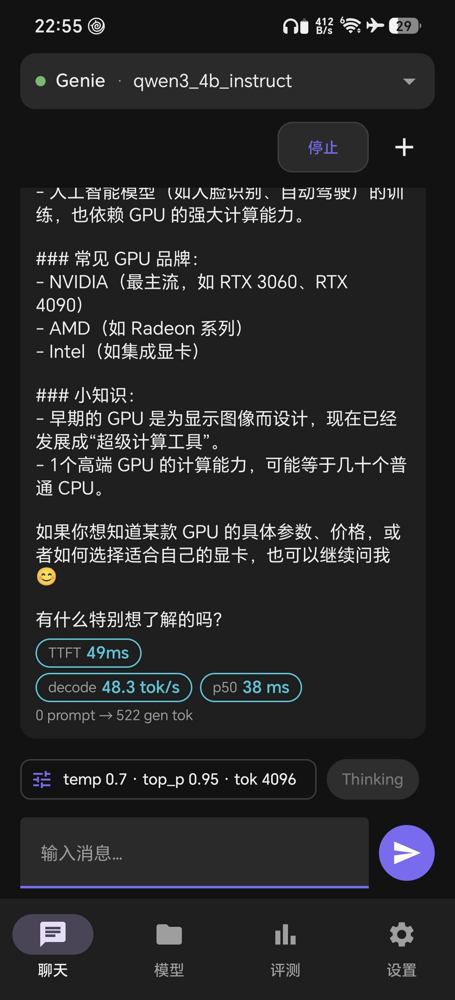
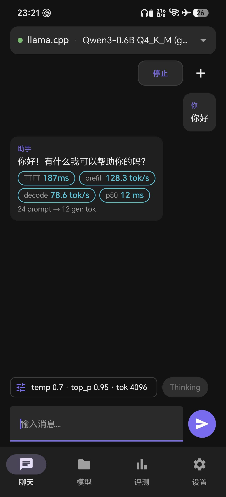
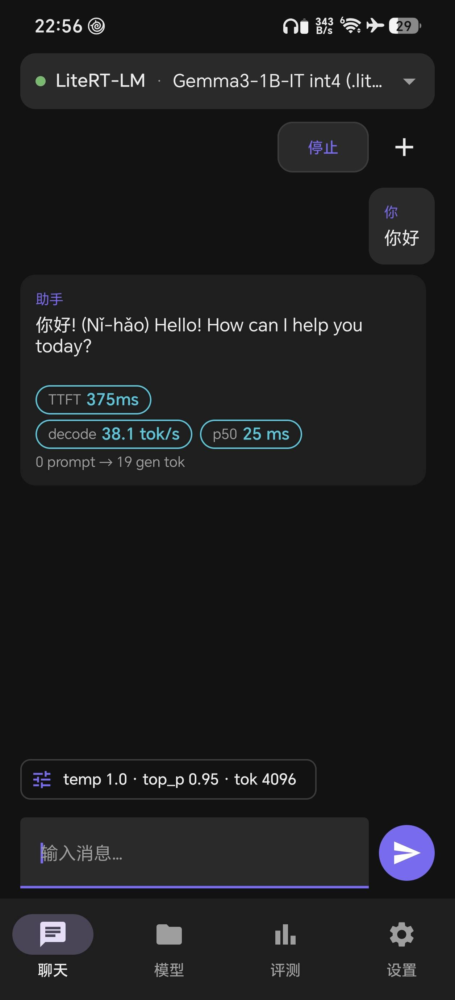
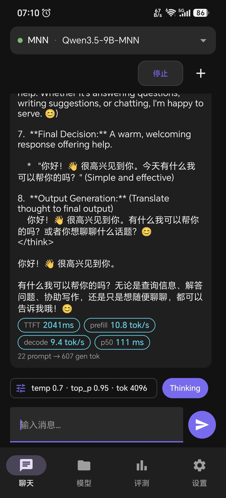

# droid-llm

**同一台真机上四引擎实测对比** · Multi-engine on-device LLM playground, compared on one phone.

**中文** | [English](#english)

---

## 中文

一个 Android 端的**多引擎 LLM 推理实验台**：把 Google LiteRT-LM、阿里 MNN、高通 Genie (QNN) 和 llama.cpp 四家推理栈装进同一个 App，统一聊天 UI + 统一的 TTFT / prefill / decode 计时口径，用来在同一台真机上横向比较。

推理为主，评测为辅。不做功耗测量、质量评分、雷达图。

### 功能

- **聊天**：四引擎同页切换；采样参数面板（可逐模型覆盖，不适用的字段自动灰显）；助手气泡直接挂 `TTFT` / `tok/s` / `p50`；`Thinking` 开关；溢出菜单「新建会话」
- **模型**：每个引擎独立配置自己的模型（四种格式**互不通用**）；绝对路径 + 内置文件浏览器（`MANAGE_EXTERNAL_STORAGE`）；加入前做格式校验；内置模型市场支持 **HuggingFace 官方 / hf-mirror 镜像 / ModelScope** 三源切换，并识别已下载
- **评测**：引擎 × 模型一键跑 Load / Prefill / Decode；warmup + 多轮取中位数；RSS 三段 delta；电池温度；退后台自动暂停；结果表 + 导出 JSON
- **本地 API server**：可选开启内置 **OpenAI 兼容端点**，让 PC 上的 Cherry Studio 等客户端直接调用端侧模型；支持 Bearer / `x-api-key` 鉴权，绑定地址与端口可配，前台服务通知栏可停
- **诊断**：设置 → 诊断 → 查看运行日志，真机复现后可直接分享 `.txt`（含各引擎的原生错误信息）
- **界面**：中文 / English 双语可切换；深色 / 浅色 / 跟随系统；多模型驻留开关（默认关）；清空 benchmark 库

### 截图（真机实测，各引擎在此机上最快的后端）

真机（HONOR BKQ-AN80 / Snapdragon 8 Elite / Android 17）实测。四张图分别是各引擎**在本机跑得最快的后端组合**下的聊天界面 —— 与 GitHub Release 页面的截图是同一组文件：

<table>
<tr>
<td align="center"><br><sub>Genie (QNN) · NPU · Qwen3-4B</sub></td>
<td align="center"><br><sub>llama.cpp · CPU · Qwen3-0.6B</sub></td>
<td align="center"><br><sub>LiteRT-LM · CPU · Gemma3-1B</sub></td>
<td align="center"><br><sub>MNN · GPU · Qwen3.5-9B</sub></td>
</tr>
</table>

| 引擎 | 最快后端 | 实测模型 | TTFT | Decode |
|------|----------|----------|------|--------|
| Genie (QNN) | **NPU**（HTP V81） | Qwen3-4B-Instruct-2507 w4a16 | 49 ms | 48.3 tok/s |
| llama.cpp | **CPU** | Qwen3-0.6B Q4_K_M | 187 ms | 78.6 tok/s |
| LiteRT-LM | **CPU** | Gemma3-1B-IT int4 | 375 ms | 38.1 tok/s |
| MNN | **GPU**（OpenCL） | Qwen3.5-9B-MNN | 2041 ms | 9.4 tok/s |

> 四张图是同一次真机会话的抓取，**模型各不相同，故上表不可横向比快慢** —— 它只回答「该引擎在本机该用哪个后端」。跨模型 / 跨量化的对比请在评测页固定同一模型跑。

### 已知问题

- **LiteRT-LM + GPU**：生成会不断重复同一段回答且**无法停止**。请使用 **LiteRT-LM + CPU**（也是本项目默认验证口径）。历史上的同类退化修复见 `docs/litert.md`。
- **Genie** 需要 Qualcomm 设备与 QAIRT 运行时；非骁龙 HTP 机型上该引擎显示「不支持」。
- 同一时刻只加载一个模型；默认单模型驻留（设置里可开多模型驻留）。

### Benchmark 导出格式

> 下表只说明评测页导出的**字段**，**数字是占位值、不是实测结果**（真实数字由你在评测页跑出来）。

| Engine | Model | Quant | Load(ms) | TTFT(ms) | Prefill tps | Decode tps | RSS peak |
|--------|-------|-------|----------|----------|-------------|------------|----------|
| MNN | qwen1.5b/mnn | w4a16 | 1200 | 180 | 320 | 38 | 2100 |
| llama.cpp | qwen1.5b-q4_k_m.gguf | Q4_K_M | 900 | 220 | 280 | 42 | 1800 |
| LiteRT | qwen1.5b.litertlm | f16 | 2100 | 260 | 250 | 30 | 3200 |
| Genie | qwen1.5b_genie/ | w4a16 | 1500 | 150 | 350 | 45 | 1900 |

> 跨模型 / 跨量化数字**只作参考**，不构成绝对快慢结论。

### 构建

```powershell
$env:JAVA_HOME = "D:\dev\AndroidStudio\jbr"
$env:ANDROID_HOME = "D:\dev\android_sdk"

# Debug（applicationId 后缀 .debug，可与正式版并存）
.\gradlew.bat :app:assembleDebug

# 开发机 / 无 QAIRT（Genie 灰显）
.\gradlew.bat :app:assembleDebug -Pdroid.skipGenie=true

# 正式版（读环境变量签名）
.\gradlew.bat :app:assembleRelease
```

**QNN HTP arch 裁剪**：debug 等非 release 构建默认只打 `libQnnHtpV81{Skel,Stub}.so`
（开发机 SM8850 → V81，省约 23 MB）；release 保留 QAIRT SDK 全部 arch 供 GitHub Release。
需要其它组合时用 `-Pdroid.qnnHtpVersions=79,81`，全量用 `-Pdroid.qnnHtpVersions=all`。

**正式版签名**（环境变量，不写进仓库）：

| 变量 | 说明 |
|------|------|
| `KEY_STORE` / `KEY_STORE_LOCATION` | keystore 路径 |
| `KEY_STORE_PASSWORD` | store 密码 |
| `KEY_ALIAS` | key alias |
| `KEY_PASSWORD` | key 密码 |

- arm64-v8a only，单 APK，无 Dynamic Feature
- debug：`io.github.pisces312.droidllm.debug` / 名称 `droid-llm debug`；release：`io.github.pisces312.droidllm` / 名称 `droid-llm`，可同机安装
- QAIRT：`QAIRT_PATH=D:\dev\qairt\2.50.0.260828`（见 `docs/genie.md`）
- 工具链：AGP 8.13.2 / Kotlin 2.2.21 + KSP 2.3.6 / Compose BOM 2025.05.00

### 参考项目（上游）

| 引擎 | 上游项目 | GitHub | 参考内容 |
|------|----------|--------|----------|
| LiteRT | LiteRT-LM | https://github.com/google-ai-edge/LiteRT-LM | 推理框架本体（`litertlm-android` AAR 闭源） |
| LiteRT | Google AI Edge Gallery | https://github.com/google-ai-edge/gallery | LiteRT-LM 接入、模型 allowlist / HF 下载 URL、`LlmChatModelHelper` |
| MNN | MNN | https://github.com/alibaba/MNN | 引擎本体（预编译 `libMNN.so`，`MNN_BUILD_LLM=ON`）；参考实现 `apps/Android/MnnLlmChat`（模型市场、HF/ModelScope 双源、目录扫描） |
| Genie (QNN) | AI Hub Apps | https://github.com/qualcomm/ai-hub-apps | `chatapp_android`：`genie_config.json` 解析、prompt tags、QAIRT 打包布局（Genie SDK 本体闭源，需遵守 Qualcomm 条款） |
| llama.cpp | llama.cpp | https://github.com/ggml-org/llama.cpp | 已 **vendored** 到 `third_party/llama.cpp/`（非 submodule） |
| llama.cpp | ChatterUI | https://github.com/Vali-98/ChatterUI | Android 端集成方式与 GGUF 模型管理 |

引擎专属结论与踩坑见 `docs/<engine>.md`；依赖获取、编译开关、许可摘要见 `docs/ENGINE_INTEGRATION.md`。

### 文档

| 文档 | 内容 |
|------|------|
| `DESIGN.md` | 架构与引擎契约（权威） |
| `UI_DESIGN.md` | 界面与交互（权威） |
| `IMPLEMENTATION.md` | 阶段执行与交付 |
| `docs/ENGINE_INTEGRATION.md` | 依赖、编译开关、模型导出 |
| `docs/MODEL_PATHS.md` | 模型下载与存放（布局、导入迁移） |

### 许可与第三方合规

本项目自身代码以 **Apache-2.0** 发布，全文见仓库根 `LICENSE`。

随 APK 打包的第三方组件：

| 组件 | 集成方式 | 许可 |
|------|----------|------|
| llama.cpp / ggml / minja | vendored 源码，静态链接 | MIT |
| cpp-httplib / nlohmann-json / miniaudio / subprocess.h | vendored | MIT / Public Domain |
| MNN（`libMNN.so`） | 预编译 `.so`，动态链接 | Apache-2.0 |
| LiteRT-LM（`litertlm-android` AAR） | Gradle 依赖 | Apache-2.0 |
| AndroidX / Compose / Lifecycle / Navigation / AppCompat / Kotlin | Gradle 依赖 | Apache-2.0 |
| **QAIRT / Genie（`libGenie.so` + QNN 运行时）** | 预编译 `.so`，随应用打包 | **Qualcomm 专有** |

- **Qualcomm QAIRT / Genie**：按 Qualcomm AI Stack License 使用 —— 仅允许以**目标码形式与应用集成**分发，**禁止单独再分发 SDK**，禁止逆向工程 / 反编译，并受美国出口管制约束。本仓库**不包含**该 SDK；自行构建 Genie 引擎需自备 QAIRT 并自行接受其条款。
- **模型权重**不随仓库与 APK 分发，由用户自备；权重的许可与代码许可相互独立（内置模型市场只提供下载地址）。
- **厂商 logo**（`ui/components/VendorLogo.kt` + `res/drawable-nodpi/*.webp`）仅作标识性使用；若权利方要求下架，从该映射中移除即可。
- 完整的核查方法、逐项依赖许可表与选型决策记录见 `docs/LICENSING.md`。

---

## English

An Android **multi-engine LLM playground**: four inference stacks — Google LiteRT-LM, Alibaba MNN, Qualcomm Genie (QNN) and llama.cpp — behind one chat UI with one shared TTFT / prefill / decode timing convention, so they can be compared on the same physical device.

Inference first, benchmarking second. No power measurement, no quality scoring, no radar charts.

### Features

- **Chat**: switch engines on one page; sampling panel with per-model overrides (inapplicable fields greyed out); `TTFT` / `tok/s` / `p50` shown on every assistant bubble; `Thinking` toggle; "New chat" in the overflow menu
- **Models**: each engine keeps its own model config (the four formats are **not** interchangeable); absolute paths + a built-in file browser (`MANAGE_EXTERNAL_STORAGE`); format validation before adding; built-in model market with **HuggingFace / hf-mirror / ModelScope** source switching and downloaded-model detection
- **Benchmark**: one-tap Load / Prefill / Decode per engine × model; warmup + median of N runs; three-stage RSS delta; battery temperature; auto-pause when backgrounded; result table + JSON export
- **Local API server**: optional built-in **OpenAI-compatible endpoint** so desktop clients such as Cherry Studio can call the on-device model; Bearer / `x-api-key` auth, configurable bind address and port, foreground service with a stop action
- **Diagnostics**: Settings → Diagnostics → run log, shareable as `.txt` after reproducing on device (includes each engine's native errors)
- **UI**: Chinese / English switchable; dark / light / follow system; multi-model residency toggle (off by default); clear the benchmark store

### Screenshots (on-device, each engine's fastest backend here)

Captured on a physical device (HONOR BKQ-AN80 / Snapdragon 8 Elite / Android 17). Each shot shows the chat screen with the engine's **own fastest backend on this phone** — the same four files attached to the GitHub Release:

<table>
<tr>
<td align="center"><br><sub>Genie (QNN) · NPU · Qwen3-4B</sub></td>
<td align="center"><br><sub>llama.cpp · CPU · Qwen3-0.6B</sub></td>
<td align="center"><br><sub>LiteRT-LM · CPU · Gemma3-1B</sub></td>
<td align="center"><br><sub>MNN · GPU · Qwen3.5-9B</sub></td>
</tr>
</table>

| Engine | Fastest backend | Model used | TTFT | Decode |
|--------|-----------------|------------|------|--------|
| Genie (QNN) | **NPU** (HTP V81) | Qwen3-4B-Instruct-2507 w4a16 | 49 ms | 48.3 tok/s |
| llama.cpp | **CPU** | Qwen3-0.6B Q4_K_M | 187 ms | 78.6 tok/s |
| LiteRT-LM | **CPU** | Gemma3-1B-IT int4 | 375 ms | 38.1 tok/s |
| MNN | **GPU** (OpenCL) | Qwen3.5-9B-MNN | 2041 ms | 9.4 tok/s |

> The four rows use different models, so **this is not a cross-engine speed ranking** — it only says which backend each engine should use on this device. Pin one model on the Benchmark page for a real cross-model / cross-quant comparison.

### Known issues

- **LiteRT-LM + GPU**: generation loops on the same answer forever and **cannot be stopped**. Use **LiteRT-LM + CPU** (the project's default verified path). Past regressions of the same kind are documented in `docs/litert.md`.
- **Genie** requires a Qualcomm device with the QAIRT runtime; on non-Snapdragon-HTP phones the engine reports "unsupported".
- Only one model is resident at a time; single-model residency is the default (multi-model residency is opt-in in Settings).

### Benchmark export format

> The table below only documents the **fields** of a Benchmark-page export. **The numbers are placeholders, not measurements** — real numbers come from your own run.

| Engine | Model | Quant | Load(ms) | TTFT(ms) | Prefill tps | Decode tps | RSS peak |
|--------|-------|-------|----------|----------|-------------|------------|----------|
| MNN | qwen1.5b/mnn | w4a16 | 1200 | 180 | 320 | 38 | 2100 |
| llama.cpp | qwen1.5b-q4_k_m.gguf | Q4_K_M | 900 | 220 | 280 | 42 | 1800 |
| LiteRT | qwen1.5b.litertlm | f16 | 2100 | 260 | 250 | 30 | 3200 |
| Genie | qwen1.5b_genie/ | w4a16 | 1500 | 150 | 350 | 45 | 1900 |

> Cross-model / cross-quant numbers are **indicative only**, not an absolute speed verdict.

### Build

```powershell
$env:JAVA_HOME = "D:\dev\AndroidStudio\jbr"
$env:ANDROID_HOME = "D:\dev\android_sdk"

# Debug (.debug applicationId suffix, installs side by side with release)
.\gradlew.bat :app:assembleDebug

# Dev machine without QAIRT (Genie greyed out)
.\gradlew.bat :app:assembleDebug -Pdroid.skipGenie=true

# Release (reads signing credentials from environment variables)
.\gradlew.bat :app:assembleRelease
```

**QNN HTP arch trimming**: non-release variants ship only `libQnnHtpV81{Skel,Stub}.so`
(dev device is SM8850 → V81, saves ~23 MB); release keeps every arch from the QAIRT SDK for
GitHub Releases. Use `-Pdroid.qnnHtpVersions=79,81` for other sets, `-Pdroid.qnnHtpVersions=all` for everything.

**Release signing** (environment variables, never committed):

| Variable | Meaning |
|----------|---------|
| `KEY_STORE` / `KEY_STORE_LOCATION` | keystore path |
| `KEY_STORE_PASSWORD` | store password |
| `KEY_ALIAS` | key alias |
| `KEY_PASSWORD` | key password |

- arm64-v8a only, single APK, no Dynamic Feature
- debug: `io.github.pisces312.droidllm.debug` / label `droid-llm debug`; release: `io.github.pisces312.droidllm` / label `droid-llm` — both installable on one device
- QAIRT: `QAIRT_PATH=D:\dev\qairt\2.50.0.260828` (see `docs/genie.md`)
- Toolchain: AGP 8.13.2 / Kotlin 2.2.21 + KSP 2.3.6 / Compose BOM 2025.05.00

### Reference projects (upstream)

| Engine | Upstream project | GitHub | What it was used for |
|--------|------------------|--------|----------------------|
| LiteRT | LiteRT-LM | https://github.com/google-ai-edge/LiteRT-LM | The runtime itself (`litertlm-android` AAR is closed-source) |
| LiteRT | Google AI Edge Gallery | https://github.com/google-ai-edge/gallery | LiteRT-LM integration, model allowlist / HF download URLs, `LlmChatModelHelper` |
| MNN | MNN | https://github.com/alibaba/MNN | The engine (prebuilt `libMNN.so`, `MNN_BUILD_LLM=ON`); reference app `apps/Android/MnnLlmChat` (model market, HF/ModelScope dual source, directory scanning) |
| Genie (QNN) | AI Hub Apps | https://github.com/qualcomm/ai-hub-apps | `chatapp_android`: `genie_config.json` parsing, prompt tags, QAIRT packaging layout (Genie SDK itself is closed-source, subject to Qualcomm terms) |
| llama.cpp | llama.cpp | https://github.com/ggml-org/llama.cpp | **Vendored** into `third_party/llama.cpp/` (not a submodule) |
| llama.cpp | ChatterUI | https://github.com/Vali-98/ChatterUI | Android integration approach and GGUF model management |

Engine-specific findings and pitfalls live in `docs/<engine>.md`; dependency acquisition, build flags and the licence summary are in `docs/ENGINE_INTEGRATION.md`.

### Documentation

| Document | Content |
|----------|---------|
| `DESIGN.md` | Architecture and engine contract (authoritative) |
| `UI_DESIGN.md` | UI and interaction design (authoritative) |
| `IMPLEMENTATION.md` | Phase plan and deliverables |
| `docs/ENGINE_INTEGRATION.md` | Dependencies, build flags, model export |
| `docs/MODEL_PATHS.md` | Model download and storage (layout, import/migration) |

### License & third-party compliance

This project's own code is released under **Apache-2.0** — see `LICENSE` at the repository root.

Third-party components bundled into the APK:

| Component | Integration | License |
|-----------|-------------|---------|
| llama.cpp / ggml / minja | vendored source, statically linked | MIT |
| cpp-httplib / nlohmann-json / miniaudio / subprocess.h | vendored | MIT / Public Domain |
| MNN (`libMNN.so`) | prebuilt `.so`, dynamically linked | Apache-2.0 |
| LiteRT-LM (`litertlm-android` AAR) | Gradle dependency | Apache-2.0 |
| AndroidX / Compose / Lifecycle / Navigation / AppCompat / Kotlin | Gradle dependency | Apache-2.0 |
| **QAIRT / Genie (`libGenie.so` + QNN runtime)** | prebuilt `.so`, shipped inside the app | **Qualcomm proprietary** |

- **Qualcomm QAIRT / Genie**: governed by the Qualcomm AI Stack License — redistribution is allowed **only as object code integrated with the application**; **standalone redistribution of the SDK is prohibited**, as are reverse engineering / decompilation, and it is subject to US export control. This repository does **not** contain that SDK; building the Genie engine yourself requires your own QAIRT and your own acceptance of its terms.
- **Model weights** are not distributed with the repository or the APK; bring your own. Weight licences are independent of the code licence (the built-in model market only provides download URLs).
- **Vendor logos** (`ui/components/VendorLogo.kt` + `res/drawable-nodpi/*.webp`) are used for identification only; remove an entry from that mapping if a rights holder requests it.
- The full audit method, the per-dependency licence table and the selection rationale are in `docs/LICENSING.md`.
