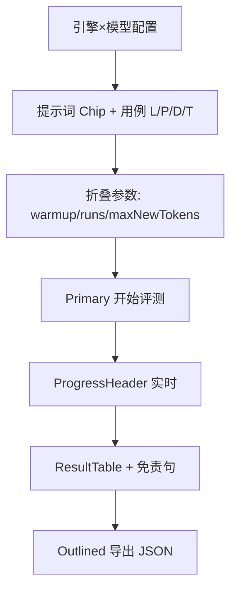

# droid-llm UI / 交互设计

> 本文档是 **界面与交互的唯一权威来源**。架构与引擎契约见 `DESIGN.md`，阶段执行见 `IMPLEMENTATION.md`。
> 冲突时：引擎/数据契约以 `DESIGN.md` 为准；视觉与交互以本文为准。
>
> 风格参照（本机工程）：
> - **StreamClip**（`D:\my-projects\StreamClip`）— 工具型深色 App：M3 Dark、紫主色 + 青强调、灰阶卡片、12dp 圆角按钮、52dp 触控高度、多 Fragment 高密度工具面
> - **PixelPlayerOSS**（`D:\3rd-party-projects\PixelPlayerOSS`）— Compose M3 工程化：双套 Light/Dark ColorScheme、透明状态栏与图标亮度、Typography 独立成文件、Color token 集中定义
>
> 定位：**评测工具**，不是内容消费 App。参考 StreamClip 的信息密度与按钮规范，采用 PixelPlayer 的 M3 双套主题与工程落地方式。**不**用 PixelPlayer 的音乐感大标题/展示型字体。

---

## 1. 风格锚点（Style Anchor）

| 项 | 选择 | 来源 |
|----|------|------|
| 类型 | 本机工具 / 调试台 | StreamClip |
| 底色 | 深色为主（跟随系统可切浅色） | StreamClip Dark + PixelPlayer 双套 |
| 强调 | 紫靛主色 + 青色数据强调 | StreamClip purple/teal |
| 表面 | 深灰层级卡片，非纯黑 | StreamClip gray_800/900 |
| 形 | 卡片 12dp / 按钮 12dp / Chip 全圆 | StreamClip `cornerRadius 12dp` |
| 字 | 系统字体（中英文清晰），不用展示字体 | 工具可读性优先 |
| 动效 | 默认 M3；无循环装饰动画 | 避免干扰读数 |

---

## 2. 色彩 Token（`ui/theme/Color.kt` 集中定义）

### 2.1 深色（默认）

| Token | Hex | 用途 |
|-------|-----|------|
| `Bg` | `#121212` | 页面底 |
| `Surface` | `#1E1E1E` | 卡片 |
| `SurfaceHigh` | `#2A2A2A` | 次级容器 / 输入框 |
| `Outline` | `#3C3C3C` | 分割线、描边 |
| `Primary` | `#7C6AF5` | 主按钮、选中、链接（StreamClip 紫的 M3 化） |
| `OnPrimary` | `#FFFFFF` | 主色上文字 |
| `Accent` | `#26C6DA` | 青强调：tps/TTFT 数字、进度、图表（对齐 StreamClip teal_200） |
| `Warn` | `#FFB74D` | 温度警告、空回复重试 |
| `Error` | `#EF5350` | 失败样本、不可用 |
| `Ok` | `#66BB6A` | 可用状态点 |
| `TextPrimary` | `#EDEDED` | 正文 |
| `TextSecondary` | `#9E9E9E` | 次要 / 说明（StreamClip gray_500） |
| `TextDisabled` | `#616161` | 禁用（gray_700） |

### 2.2 浅色

| Token | Hex | 用途 |
|-------|-----|------|
| `Bg` | `#F6F5FB` | 页面底（PixelPlayer LightBackground 邻近） |
| `Surface` | `#FFFFFF` | 卡片 |
| `SurfaceHigh` | `#EEEAF8` | 次级容器 |
| `Primary` | `#5B4BD6` | 主色 |
| `Accent` | `#00838F` | 数据强调 |
| `TextPrimary` | `#1C1B22` | 正文 |
| `TextSecondary` | `#5F5A6E` | 次要 |
| `Error` / `Warn` / `Ok` | `#D32F2F` / `#B26A00` / `#2E7D32` | 语义同深色 |

**规则**：同一语义在 Light/Dark 下角色不变；数字指标一律 `Accent`；错误样本文字用 `Error` 且加 `·` 前缀短因，不整行标红。

**可选增强（P5）**：Material You 动态取色（PixelPlayer 有 `dynamicColorScheme`）；默认关闭，Settings 提供开关，评测读数场景优先稳定对比度。

---

## 3. 字体与尺度（`ui/theme/Type.kt`）

- 字体族：`FontFamily.Default`（CJK 系统字体），**不引入** Montserrat/展示变体
- 数字：等宽倾向（`FontFeature` tabular，若可用），避免 tps 跳动抖列宽

| Style | Size / Weight | 用途 |
|-------|---------------|------|
| Title | 20sp / 600 | 页面标题 |
| Headline | 16sp / 600 | 分区标题 |
| Body | 14sp / 400 | 正文、列表 |
| Label | 12sp / 500 | 标签、Chip |
| Caption | 11sp / 400 | 脚注、免责句 |
| Metric | 18sp / 700 tabular | 结果表关键数字 |
| MetricSmall | 13sp / 600 tabular | 行内 tps |

---

## 4. 布局与组件

### 4.1 网格 / 间距

- 水平边距 **16dp**；区块垂直间距 **12dp**；卡片内边距 **12–16dp**
- 触控：按钮 `minHeight 52dp`（StreamClip SettingButton）、图标按钮 44dp
- 列表行高：普通 56dp；双行 72dp

### 4.2 通用组件（四页共用）

| 组件 | 规格 |
|------|------|
| `EngineStatusCard` | 一行：状态点 + 引擎名 + 状态句；灰显时透明度 45% |
| `ModelPicker` | Outlined 下拉；空态文案 +「去 Models 页」 |
| `MetricPill` | 圆角胶囊，`Accent` 描边，展示 `TTFT/tps` |
| `PrimaryButton` | 52dp 高，12dp 圆角，`Primary` 填充 |
| `OutlinedToolButton` | 灰描边 + `SurfaceHigh` 底（StreamClip 样式） |
| `ProgressHeader` | 线性进度 + 主副文案 + 取消 |
| `ResultTable` | 横向可滚动；首列冻结引擎名 |
| `WarningBanner` | `Warn` 底色 12% 透明，一行可关闭 |
| 状态栏 | 透明；图标亮度随 `Bg`（PixelPlayer StatusBar 处理） |

### 4.3 底部导航

- 4 Tab：`聊天` / `模型` / `评测` / `设置`（M3 NavigationBar）
- 选中：`Primary` 图标+标签；未选：`TextSecondary`

---

## 5. 分页交互

### 5.1 聊天（Chat）

- 顶栏：引擎 Chip（不可用灰显）+ 模型 Chip + 溢出菜单（**「新建会话」**：清空上下文，走 `reset(handle)`，DESIGN §1.2 契约的 UI 落点）
- 消息：用户右/助手左气泡；助手气泡下挂 `MetricPill`（TTFT、本次 tok/s）
- 参数：**可折叠「采样参数」面板**（temp / top_k / top_p / threads / backend / maxNewTokens），默认值取自 Settings；不适用当前引擎的字段灰显 + 12sp 说明（DESIGN §1.2 字段适用性）。此项为 DESIGN §4 信息架构要求，P0 已实现，不可移除
- 输入：多行，发送钮 `Primary`；生成中变「停止」
- 空态：「先在模型页添加模型，或使用 Fake 引擎试用」
- 错误：气泡内红色短行，不弹窗打断

### 5.2 模型（Models）

- 四张引擎卡，每卡标题行 = `EngineStatusCard`
- 卡内：已配模型列表（名称、路径缩略、quant 徽章）+「添加」「校验」「删除」
- 添加：绝对路径输入 + **内置文件浏览器**（按引擎过滤：`.gguf` / `.litertlm` / `.task` 文件，MNN/Genie 选目录；需 `MANAGE_EXTERNAL_STORAGE`，未授权仅可浏览 App 私有目录并给授权引导；其他 App 的 `Android/data/` 灰显不可选）。SAF 降级为可选外部分享入口，P5 不强制（DESIGN §1.3）
- 校验失败：行内红字原因（缺哪个文件写哪个）

### 5.3 评测（Benchmark）— P4 主界面

- **配置**：可用引擎默认勾选；勾选后展开 `ModelPicker`；提示词 4 Chip 单选；用例默认 L/P/D
- **跑前**：`WarningBanner`「建议插电、静置冷却（>42℃ 仅警告）」
- **进行中**：`引擎 2/3 · Decode · 样本 3/4`（样本数含 warmup，默认 warmup=1 + runs=3 即共 4）+ 最近 `decode xx tok/s`；可取消
- **退后台**：自动暂停（DESIGN §3.3）；返回时 ProgressHeader 呈暂停态（`Warn` 描边），提供「继续 / 放弃本次评测」两动作，暂停区间不计时
- **结果表列**：引擎 / 模型 / Quant / Load / TTFT / Prefill / Decode / RSS peak / 温度
  - 失败格：`Error` 色短因，不显示 0
  - 空值：`—`
- **底部固定** Caption：「跨模型/跨量化只作参考，不构成绝对快慢结论」
- **历史**：列表可清空；导出路径提示 Snackbar

### 5.4 设置（Settings）

- 默认采样：temp / top_k / top_p / threads / maxNewTokens / backend
- 内存：**多模型驻留开关**（默认关 = 单模型驻留，切换即 unload；DESIGN §3.3），开启行附 12sp 警告「8GB 机型易 OOM」
- 数据：导出目录、清空 benchmark 库
- 外观：深色 / 浅色 / 跟随系统；（可选）动态取色
- 关于：依赖与许可摘要

---

## 6. 文案与状态规范

| 场景 | 文案模式 | 示例 |
|------|----------|------|
| 不可用 | 原因 + 一句怎么办 | 「QAIRT 未打包，Genie 不可用；用 -PskipGenie 外的构建包重装」 |
| 加载失败 | 失败点 + 检查项 | 「缺少 genie_config.json」 |
| 生成失败 | 现象 + 动作 | 「空回复，已重试 2 次仍失败」 |
| 成功 | 短确认 | 「已导出 bench_…json」 |
| 数字空 | 单字符 | `—` |
| 禁用控件 | 灰显 + 12sp 说明 | 不单独弹窗 |

原则：**不堆英文缩写**；首次出现写「首 token 延迟（TTFT）」。

---

## 7. 标志性时刻（记忆点）

1. **评测结果表**：Metric 大数字 + 青强调，一眼看出谁快；行展开看样本
2. **四引擎状态条**：绿/灰点阵列，缺依赖一目了然且不崩

---

## 8. 明确不做

- ❌ 雷达图 / 3D / 装饰插画
- ❌ 音乐播放器式大字展示字体
- ❌ 强制锁温、飞行模式弹窗
- ❌ 自动滚动马灯、循环动画

---

## 9. 实现映射

| 文档项 | 代码落点 |
|--------|----------|
| Color/Type | `app/src/main/java/.../ui/theme/{Color,Type,Theme}.kt` |
| 组件 | `app/src/main/java/.../ui/components/`（P4 新建） |
| Benchmark 页 | `ui/benchmark/BenchmarkScreen.kt` + `BenchmarkViewModel.kt` |
| Chat 对齐 | `ui/chat/*`（P5 微调 MetricPill 与间距） |

**验收**：四页同套 token；深浅色可切换；评测页在无模型时引导清晰，有结果时表+免责句齐全。
