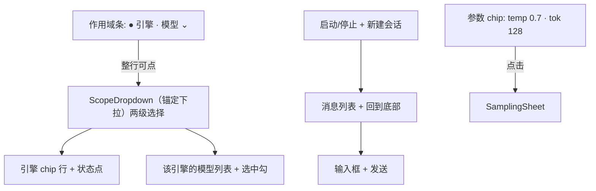
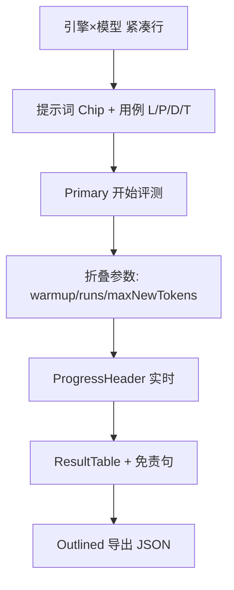

# droid-llm UI / 交互设计

> 本文档是 **界面与交互的唯一权威来源**。架构与引擎契约见 `DESIGN.md`，阶段执行见 `IMPLEMENTATION.md`。
> 冲突时：引擎/数据契约以 `DESIGN.md` 为准；视觉与交互以本文为准。
>
> 风格参照（本机工程）：
> - **StreamClip**（`D:\my-projects\StreamClip`）— 工具型深色 App：M3 Dark、紫主色 + 青强调、灰阶卡片、12dp 圆角按钮、52dp 触控高度、多 Fragment 高密度工具面
> - **PixelPlayerOSS**（`D:\3rd-party-projects\PixelPlayerOSS`）— Compose M3 工程化：双套 Light/Dark ColorScheme、透明状态栏与图标亮度、Typography 独立成文件、Color token 集中定义
>
> 定位：**评测工具**，不是内容消费 App。参考 StreamClip 的信息密度与按钮规范，采用 PixelPlayer 的 M3 双套主题与工程落地方式。**不**用 PixelPlayer 的音乐感大标题/展示型字体。

---

## 1. 风格锚点（Style Anchor）

| 项 | 选择 | 来源 |
|----|------|------|
| 类型 | 本机工具 / 调试台 | StreamClip |
| 底色 | 深色为主（跟随系统可切浅色） | StreamClip Dark + PixelPlayer 双套 |
| 强调 | 紫靛主色 + 青色数据强调 | StreamClip purple/teal |
| 表面 | 深灰层级卡片，非纯黑 | StreamClip gray_800/900 |
| 形 | 卡片 12dp / 按钮 12dp / Chip 全圆 | StreamClip `cornerRadius 12dp` |
| 字 | 系统字体（中英文清晰），不用展示字体 | 工具可读性优先 |
| 动效 | 默认 M3；无循环装饰动画 | 避免干扰读数 |

---

## 2. 色彩 Token（`ui/theme/Color.kt` 集中定义）

### 2.1 深色（默认）

| Token | Hex | 用途 |
|-------|-----|------|
| `Bg` | `#121212` | 页面底 |
| `Surface` | `#1E1E1E` | 卡片 |
| `SurfaceHigh` | `#2A2A2A` | 次级容器 / 输入框 |
| `Outline` | `#3C3C3C` | 分割线、描边 |
| `Primary` | `#7C6AF5` | 主按钮、选中、链接（StreamClip 紫的 M3 化） |
| `OnPrimary` | `#FFFFFF` | 主色上文字 |
| `Accent` | `#26C6DA` | 青强调：tps/TTFT 数字、进度、图表（对齐 StreamClip teal_200） |
| `Warn` | `#FFB74D` | 温度警告、空回复重试 |
| `Error` | `#EF5350` | 失败样本、不可用 |
| `Ok` | `#66BB6A` | 可用状态点 |
| `TextPrimary` | `#EDEDED` | 正文 |
| `TextSecondary` | `#9E9E9E` | 次要 / 说明（StreamClip gray_500） |
| `TextDisabled` | `#616161` | 禁用（gray_700） |

### 2.2 浅色

| Token | Hex | 用途 |
|-------|-----|------|
| `Bg` | `#F6F5FB` | 页面底（PixelPlayer LightBackground 邻近） |
| `Surface` | `#FFFFFF` | 卡片 |
| `SurfaceHigh` | `#EEEAF8` | 次级容器 |
| `Primary` | `#5B4BD6` | 主色 |
| `Accent` | `#00838F` | 数据强调 |
| `TextPrimary` | `#1C1B22` | 正文 |
| `TextSecondary` | `#5F5A6E` | 次要 |
| `Error` / `Warn` / `Ok` | `#D32F2F` / `#B26A00` / `#2E7D32` | 语义同深色 |

**规则**：同一语义在 Light/Dark 下角色不变；数字指标一律 `Accent`；错误样本文字用 `Error` 且加 `·` 前缀短因，不整行标红。

**可选增强（P5）**：Material You 动态取色（PixelPlayer 有 `dynamicColorScheme`）；默认关闭，Settings 提供开关，评测读数场景优先稳定对比度。

---

## 3. 字体与尺度（`ui/theme/Type.kt`）

- 字体族：`FontFamily.Default`（CJK 系统字体），**不引入** Montserrat/展示变体
- 数字：等宽倾向（`FontFeature` tabular，若可用），避免 tps 跳动抖列宽

| Style | Size / Weight | 用途 |
|-------|---------------|------|
| Title | 20sp / 600 | 页面标题 |
| Headline | 16sp / 600 | 分区标题 |
| Body | 14sp / 400 | 正文、列表 |
| Label | 12sp / 500 | 标签、Chip |
| Caption | 11sp / 400 | 脚注、免责句 |
| Metric | 18sp / 700 tabular | 结果表关键数字 |
| MetricSmall | 13sp / 600 tabular | 行内 tps |

---

## 4. 布局与组件

### 4.1 网格 / 间距

- 水平边距 **16dp**；区块垂直间距 **12dp**；卡片内边距 **12–16dp**
- 触控：按钮 `minHeight 52dp`（StreamClip SettingButton）、图标按钮 44dp
- 列表行高：普通 56dp；双行 72dp

### 4.2 通用组件（四页共用）

全部在 `app/src/main/java/.../ui/components/UiComponents.kt`。

| 组件 | 规格 |
|------|------|
| `EngineStatusCard` | 一行：`StatusDot` + 引擎名 + 状态句；灰显时透明度 45% |
| `StatusDot` | 8dp 实心 / 10dp 空心圆；三态见 §7.2，`solid=false` 表示"可用但未加载" |
| `ChoiceChipRow<T>` | 横向滚动 `FilterChip` 单选行；`dimmed` 只降透明度**不禁用**（不可用引擎仍要能点开看原因），`leading` 放状态点 |
| `DroidCard` | 内容卡：`SurfaceHigh` 底 + **1dp `outlineVariant` 描边**。浅色下卡片底与背景只有约 1.09:1 对比，边界全靠这道描边（§4.5） |
| `EmptyState` | 空态：大号 `outlineVariant` 图标 + 一句居中说明 + 可选 `PrimaryButton`。空屏没有竞争性主操作，故按钮走 Filled |
| `LabeledDropdown` | Outlined 下拉，吃 `key to label` 列表；空态文案可传 |
| `NumericField` | 数值输入框：本地 buffer + 每次输入即提交；末尾小数点不提交（见 §4.5） |
| `SheetTitle` | BottomSheet 顶部标题块（标题 + 一行上下文） |
| `VendorLogo` | 厂商 logo（40dp，圆角 8dp），未命中回落为首字母方块。资产、覆盖范围与商标说明见 `docs/LICENSING.md` §2④ |
| `MetricPill` | 圆角胶囊，`Accent` 描边，展示 `TTFT/tps` |
| `PrimaryButton` | 52dp 高（`height` 可覆盖，聊天状态行用 40dp），12dp 圆角，`Primary` 填充 |
| `OutlinedToolButton` | 灰描边 + `SurfaceHigh` 底（StreamClip 样式） |
| `ProgressHeader` | 线性进度 + 主副文案 + 取消 |
| `ResultTable` | 横向可滚动；首列冻结引擎名；**所有单元格行高固定 52dp**，表头带单位（`Load ms` / `TTFT ms` / `Prefill tok/s` / `Decode tok/s` / `RSS peak MB` / `温度 ℃`） |
| `WarningBanner` | `Warn` 底色 12% 透明，一行可关闭 |
| 状态栏 | 透明；图标亮度随 `Bg`（PixelPlayer StatusBar 处理） |
| `formatModelSize` | 模型体积，**十进制**单位（与模型站标称一致）；`.so` 体积走二进制单位，见 Settings |

### 4.3 底部导航

- 4 Tab：`聊天` / `模型` / `评测` / `设置`（M3 NavigationBar）
- 选中：`Primary` 图标+标签；未选：`TextSecondary`
- **4 个 tab 全部常驻**，不做降级到溢出菜单（2026-09-27 决策：宽度充裕）

### 4.4 控件三层职责

同一种主色填充按钮同时表达"选中 / 主操作 / 次级"会让每页都长出一排紫块，真正该突出的
主操作反而被淹没。固定三层，不再漂移：

| 层 | 控件 | 表达什么 | 反例 |
|----|------|----------|------|
| L1 筛选 / 选中 | `ChoiceChipRow`（`FilterChip`） | 一组互斥选项里"当前是哪个"：引擎、下载源、下载过滤、主题模式 | ✗ 用 Filled 按钮表示选中——未选项会看起来像禁用 |
| L2 主操作 | `PrimaryButton`（`Primary` 填充） | 这一屏最想让用户点的那**一个**动作 | ✗ 一排 Filled；✗ 每个列表行都挂一个 Filled |
| L3 次级 | `OutlinedToolButton` | 其余全部动作：取消、恢复默认、校验、删除、导出、浏览 | — |

「一屏一个 Filled」按**当前可见状态**判定，不是按代码出现次数：

- 聊天页：未加载时 Filled = 「启动」，发送钮灰显；`READY` 后「启动」降级为 Outlined「停止」，
  Filled 让给「发送」。两者永不同时为 Filled。
- 评测页：未跑时 Filled = 「开始评测」；跑起来后 Filled = 暂停态的「继续」。
- 列表行：只有在"这一行本身就是该屏唯一操作"时才允许出现 Filled。否则整屏留一个
  （模型市场即此例：「刷新状态」从每行一颗提到工具栏一颗，「下载」从 Filled 降为 Outlined——
  一屏上百条目各挂一颗 Filled 正是上面那条反例）。

### 4.5 实测速查（踩过的，勿再踩）

1. **触屏模式下点按钮不会移动输入焦点**。所以"失焦时提交"在本 App 里根本不触发
   （点「深色」按钮后输入框 `focused` 仍为 `true`）。`NumericField` 因此选择**每次输入即提交**，
   本地 buffer 只负责让 `0.` 这类中间态留在屏幕上。
2. **`"0.".toFloatOrNull()` 是合法的**（= `0.0f`，不是 null）。所以"解析失败就不提交"挡不住半截
   输入：把 `0.7` 删成 `0.` 会静默把值写成 `0.0`。必须额外挡"末尾是小数点"这一种形态。
3. **Kotlin 的块注释可以嵌套**。KDoc 里一旦出现 `/*`（例如写「drawable-nodpi 下的星号文件名」），
   就开启了一层嵌套注释，后面那个 `*/` 只关掉内层 → 整个 KDoc 报 `Unclosed comment`，
   而且**报错行号指向文件末尾**，很难第一时间联想到注释本身。注释里提文件名不要带星号通配。
4. **浅色卡片底与背景只有约 1.09:1 对比**（`#EEEAF8` 对 `#F6F5FB`），卡片边界在浅色主题下
   基本靠猜。调色板救不了这个比例：要让对比达到可辨，卡片底得深到发紫，很丑。边界只能由
   **1dp `outlineVariant` 描边**给出，所以内容卡一律走 `DroidCard`，不再裸用 `Card`。

---

## 5. 分页交互

### 5.1 聊天（Chat）

- **作用域条（顶栏第一行，整行可点）**：`● 引擎名 · 模型名 ⌄`，底色 `SurfaceHigh`、12dp 圆角。
  - **引擎和模型合并成一个入口**，不再是两个半宽下拉。模型从属于引擎（`DESIGN §1.2` 四种格式
    互不通用），两个平行下拉把这个层级藏起来了，还会把长模型名截断成两行。
  - 作用域条**本身不是引擎选择入口**：引擎只在弹层内部切换，否则又变成两个入口。
  - 状态点按 §7.2 取色；实心 = 该模型已加载，空心 = 可用但未启动。
- **状态行（顶栏第二行）**：「启动/停止」（40dp）+「新建会话」图标按钮，右对齐。
  不再常显「可用 · 未启动」状态句——语义已由作用域条状态点（§7.2）承担，瞬时反馈走运行时状态/提示。
  溢出菜单只有一个条目，故直接给图标按钮。
- **两级 `ScopeDropdown`（锚定在作用域条下方的 `Popup` 下拉面板）**：标题 + 引擎 chip 行（带状态点，不可用者灰显但仍可点）
  + 选中引擎不可用时的一行原因 + 分隔线 + 模型列表。模型条目：名称（1 行 ellipsize）
  + 副行 `引擎 · 量化 · 体积` + 右侧选中勾。列表随引擎 chip 联动。
  - **不用 `ModalBottomSheet`**：入口在顶栏，底部弹层会让手指跨半屏；下拉紧贴触发条，操作连贯。
  - **弹层里的选择仍然只是"选中"**：按 `DESIGN §1.2`，选引擎或模型只释放旧会话回到 `IDLE`，
    **不自动 load**；加载仍由「启动」触发。弹层只换外壳，不动契约。
  - 选中模型后自动收起弹层；只切引擎时保持打开，方便接着选模型。
- 模型生命周期：`SessionState = IDLE / LOADING / READY / FAILED`。「启动」先卸载旧会话再 `load()`，
  READY 后按钮变 Outlined「停止」（释放模型）。多模型驻留开启时保留驻留会话
- LOADING 态：整页覆盖 `scrim(0.32)` 全屏遮罩，中央卡片显示「正在加载模型…」+ 模型名
  + 「首次加载需数十秒，请勿离开此页」。遮罩吞掉触摸事件，**底部导航在其外层、仍可切换 Tab**。
  加载是阻塞 native 调用且不可中断，故不提供取消；`load()`/`unload()`/`reset()` 一律走
  `Dispatchers.IO`，否则主线程被占满、LOADING 状态根本渲染不出来
- 消息：用户右/助手左气泡；助手气泡下挂 `MetricPill`（TTFT、本次 tok/s）。
  **引擎未产出任何 token 时补一条「（空回复，可重试）」气泡**，状态行记为「完成（无输出）」，
  避免出现无反馈的空轮次
- **Thinking 标签不入气泡**（`ThinkingDisplay`）：空 thinking 块整段丢弃；
  Thinking 关时 thinking 块整段丢弃；Thinking 开且非空时原样保留。仅影响展示，
  发给引擎的 history 仍用原始文本；空块导致的「无可见输出」同样走「（空回复，可重试）」
- **自动滚动三件套**：新内容即滚（按**尾条内容长度**触发，因为流式 token 是替换最后一条气泡、
  `messages.size` 全程不变）／用户上滚即停跟随／非底部时右下角悬浮「回到底部」按钮
- **采样参数**：输入框上方一颗参数 chip（`AssistChip`，显示 `temp … · top_p … · tok …`），
  点击打开 `SamplingSheet`：temp / top_k / top_p / threads / backend / maxNewTokens + 底部「完成」。
  默认值取自 Settings；不适用当前引擎的字段灰显 + 12sp 说明（`DESIGN §1.2` 字段适用性）。
  此项为 `DESIGN §4` 信息架构要求，P0 已实现，**不可移除**——只是从内联折叠卡搬进 sheet（决策 4）
- **Thinking 开关**：参数 chip 同一行的 `FilterChip`（`Thinking 开` / `Thinking 关`，选中带勾）。
  **每条消息级**控制（可逐轮切换），故放在对话框旁而非 Settings（UI_REVIEW §3.2 模式 3）。
  仅当模型支持 Thinking 时显示（`ThinkingSupport`：模型名命中 qwen3/thinking/r1 等，
  或 MNN `chat_template` 含 `enable_thinking`）；不支持则整颗隐藏，不做假开关。
  生效路径：MNN 走 `jinja.context.enable_thinking`；其余引擎对 Qwen3 系在用户消息尾附
  `/think` 或 `/no_think`。默认开（对齐上游模板默认）
- 输入：多行，发送钮 `Primary`；生成中变「停止」。**仅 READY 可发送**，否则灰显 + 占位提示
  「启动模型后可发送消息」
- 空态：`EmptyState`——Folder 图标 + 「先在「模型」页添加模型，再回到这里启动它」+ **Filled**
  「去「模型」页」（走 `DroidLlmRoot` 的 `goToModels`，与评测页共用同一个 lambda）
- 错误：气泡内红色短行，不弹窗打断

### 5.2 模型（Models）

- 两个 Tab：`已注册` / `模型市场`。页头显示共享模型根目录，**行尾带复制按钮**——路径 80+ 字符，
  本来就是给人粘到文件管理器或 `adb` 里的；模型条目的路径同样各带一颗
- **页头工具位**（标题行右侧两颗图标钮，与聊天页「新建会话」同构）：
  - `＋` **注册外部模型** → `ModalBottomSheet`（复用 `SheetTitle`）。表单不占列表纵向空间；
    注册是低频动作，不常连着注册多个模型，故不为批录单独做二级页
  - `⟳` **语义随 Tab**：已注册 = 扫描模型根目录；模型市场 = 刷新下载状态。
    `contentDescription` 写清当前语义。市场 Tab 不再在说明行末另挂「刷新状态」
- **`已注册` = 纯列表**：
  - 顶部引擎过滤 `ChoiceChipRow`：`全部 · n` + 各引擎 `displayName · n`（数量实时），
    `null` = 全部。筛选只作用于列表卡片
  - 列表卡：名称 + `引擎 · 格式 · 量化` + 路径（带复制）+ 「校验」「删除」（均 Outlined）。
    **本 Tab Filled 数为 0**——主操作「注册」在 Sheet 里，扫描在页头图标
  - **空态两档**：整库空 → `EmptyState`「浏览模型市场」（并提示右上角 ＋）；
    筛选空 → 「该引擎下暂无已注册模型」+「显示全部」。**这里不加厂商 logo**——
    `LocalModel` 没有 `vendor` 字段（引擎只知道路径），靠名字猜会把 `TinyLlama` 标成 Meta Llama
- **注册 Sheet**：引擎 `ChoiceChipRow` + 格式提示 + 显示名 + 路径（尾部图标开内置文件浏览器）+
  **`注册模型（保留原路径）` 是 Sheet 内唯一 Filled** + 市场路径说明 caption。
  校验失败 **不关 Sheet**（`register()` 返回是否通过），错误走页头消息行
  - **外部模型只登记、不搬文件**：引擎直接打开原路径；只有市场下载的模型严格放在
    模型根目录（`{hf|modelscope}/models--org--repo/snapshots/`）。名称用「注册」而非「导入」——
    语义是登记索引，不是搬移文件
  - 注册成功：关 Sheet、筛选复位到「全部」，保证新条目可见
  - 路径选择：绝对路径 + **内置文件浏览器**（按引擎过滤：`.gguf` / `.litertlm` / `.task` 文件，
    MNN/Genie 选目录；需 `MANAGE_EXTERNAL_STORAGE`，未授权仅可浏览 App 私有目录并给授权引导；
    其他 App 的 `Android/data/` 灰显不可选）。SAF 降级为可选外部分享入口，P5 不强制（`DESIGN §1.3`）
  - 校验失败（列表行）：行内红字原因（缺哪个文件写哪个）
- **`模型市场`**：下载源 chip 行（`HF官方 / HF镜像 / ModelScope`）+ 下载过滤 chip 行
  （`全部 / 已下载 / 未下载`）；条目：**左侧厂商 logo**（`VendorLogo`，40dp；catalog 的 `vendor`
  精确匹配，未命中回落首字母）+ 名称 / `引擎 · 厂商 · 体积` / tags / 描述 / 下载进度；
  动作按 §4.4 分层，`下载` / `已下载 · 注册` 走 `OutlinedToolButton`（这一屏 Filled 数为 0：
  上百条目各挂一颗 Filled 正是 §4.4 举的反例）
- 引擎与厂商显示名一律走 `EngineId.displayName` / `engineIdFromStorage()` 反解，
  **不得**直接打印持久化的 `EngineId.name`（详见 `docs/UI_REVIEW.md` §4.1 P0-1）

### 5.3 评测（Benchmark）— P4 主界面

- **引擎 × 模型 = 每引擎一行（约 52dp），不是每引擎一卡**。一行内：`Checkbox` + `StatusDot` +
  引擎名 + 右侧四选一（已选模型名 / 下拉箭头 / 「去「模型」页」 / 不可用原因）。
  卡片式布局在四个引擎默认全勾选时要占约 540dp，把「开始评测」直接挤出首屏；行式约 210dp。
  仍保留多选——一次评测比的是「多引擎各钉一个模型」
- **「开始评测」必须落在首屏**：它是全页唯一 Filled（§4.4），排在**必填**项（引擎 / 提示词 / 用例）
  之后、**可选的运行参数之前**。参数有合理默认值，不该挡在主操作前面
- **提示词 4 Chip 单选**；用例默认 L/P/D
- **跑前**：`WarningBanner`「建议插电、静置冷却；>42℃ 仅警告，不中断」——**控制在一行**，
  两行会把「开始评测」再次挤出首屏
- **进行中**：`引擎 2/3 · Decode · 样本 3/4`（样本数含 warmup，默认 warmup=1 + runs=3 即共 4）+ 最近 `decode xx tok/s`；可取消
- **退后台**：自动暂停（DESIGN §3.3）；返回时 ProgressHeader 呈暂停态（`Warn` 描边），提供「继续 / 放弃本次评测」两动作，暂停区间不计时
- **结果表列**：`引擎 / 模型 / Quant / Load ms / TTFT ms / Prefill tok/s / Decode tok/s / RSS peak MB / 温度 ℃`
  - **表头必须带单位**：只写 `Load` 无法判断是 ms 还是 s，行内数字又不带单位
  - 失败格：`Error` 色短因，不显示 0
  - 空值：`—`
- **结果表下方** Caption：「跨模型/跨量化只作参考，不构成绝对快慢结论」
- **历史**：列表可清空（引擎列同样走 `engineIdFromStorage()` 反解，Room 里存的是 `EngineId.name`）；
  导出路径提示 Snackbar

### 5.4 设置（Settings）

- 默认采样：temp / top_k / top_p / threads / maxNewTokens / backend
  - 数值框全部走 `NumericField`（§4.5 的两条反直觉事实即出自此处）
  - **backend 是 `LabeledDropdown`，不是只读输入框**——只读 `OutlinedTextField` 长得像能输入，
    点了没反应；候选为该引擎支持的 backend
- 内存：**多模型驻留开关**（默认关 = 单模型驻留，切换即 unload；`DESIGN §3.3`），开启行附 12sp 警告「8GB 机型易 OOM」
- 系统提示词：默认 `You are a helpful assistant.`，可改可清空（清空会导致 MNN 上极短首轮直接出 EOS，
  详见 `docs/mnn.md` §2）
- 数据：导出目录、清空 benchmark 库
- 外观：深色 / 浅色 / 跟随系统，用 `ChoiceChipRow` 表达选中（**不是** Filled/Outlined 按钮对，§4.4）
- 关于：依赖与许可摘要、原生库 MD5

---

## 6. 文案与状态规范

| 场景 | 文案模式 | 示例 |
|------|----------|------|
| 不可用 | 原因 + 一句怎么办 | 「QAIRT 未打包，Genie 不可用；用 -PskipGenie 外的构建包重装」 |
| 加载失败 | 失败点 + 检查项 | 「缺少 genie_config.json」 |
| 生成失败 | 现象 + 动作 | 「空回复，已重试 2 次仍失败」 |
| 成功 | 短确认 | 「已导出 bench_…json」 |
| 数字空 | 单字符 | `—` |
| 禁用控件 | 灰显 + 12sp 说明 | 不单独弹窗 |

原则：**不堆英文缩写**；首次出现写「首 token 延迟（TTFT）」。

---

## 7. 标志性时刻（记忆点）

1. **评测结果表**：Metric 大数字 + 青强调，一眼看出谁快；行展开看样本（**仍未实现**，R4 亦未做——属新功能，见 `docs/UI_REVIEW.md` §4.1 P0-6 与 §5.2「R4 实测补充」）
2. **四引擎状态条**：绿/灰点阵列，缺依赖一目了然且不崩
3. **厂商 logo 阵列**：模型市场每个条目左侧一枚厂商标，扫一眼就知道是哪家；未命中的回落为首字母方块，
   列不会出现空洞（§2④ 的商标说明见 `docs/LICENSING.md`）

### 7.1 引擎状态点 `●` 的三态映射

一处定义（`StatusDot`），四处复用（作用域条 / ScopeDropdown 引擎 chip / `EngineStatusCard` / 未来评测页）。

| 引擎可用性 / 会话态 | 颜色 | 形态 | 语义 |
|---|---|---|---|
| `Available` + 会话 `IDLE` | 绿 `Ok` | 空心环 | 可用，未加载 |
| `Available` + 会话 `READY`（当前模型已加载） | 绿 `Ok` | 实心点 | 正在使用 |
| 加载中 / 生成中 | 琥珀 `Warn` | 实心点 | 忙 |
| `MissingDependency` / `UnsupportedSoc` / `ModelNotConfigured` / `InvalidModel` | 灰 `TextDisabled` | 实心点 | 不可用 |

- 不可用引擎在 chip 行里**只降文字透明度，不禁用点击**——它必须能点开，才能读到一行原因。
- 原因文案（`EngineChoice.unavailableReason()`）由 ScopeDropdown 引擎 chip 区展示，不许各写一份。

---

## 8. 明确不做

- ❌ 雷达图 / 3D / 装饰插画
- ❌ 音乐播放器式大字展示字体
- ❌ 强制锁温、飞行模式弹窗
- ❌ 自动滚动马灯、循环动画

---

## 9. 实现映射

| 文档项 | 代码落点 |
|--------|----------|
| Color/Type/Theme（含 `outlineVariant` 卡片描边） | `app/src/main/java/.../ui/theme/{Color,Type,Theme}.kt` |
| 组件（含 §4.4 三层职责、§7.1 状态点、`DroidCard` / `EmptyState`） | `app/src/main/java/.../ui/components/UiComponents.kt` |
| 厂商 logo（映射 + 首字母回落） | `ui/components/VendorLogo.kt`；资产 `app/src/main/res/drawable-nodpi/`；生成脚本 `scripts/shrink_vendor_logos.py` |
| Chat 作用域条 / 两级 sheet / 参数 sheet / 空态 | `ui/chat/ChatScreen.kt`；选择契约 `ui/chat/ChatViewModel.kt` |
| Models chip 行 / 控件分层 / logo / 路径复制 / 空态 | `ui/models/ModelsScreen.kt`（复制按钮为页内私有 `CopyPathButton`） |
| Benchmark 引擎行 / 开始按钮位置 / 表头单位 | `ui/benchmark/BenchmarkScreen.kt` + `BenchmarkViewModel.kt` |
| Settings 数值框 / backend 下拉 / 外观 chip | `ui/settings/SettingsScreen.kt` |
| Tab 跳转（Chat 与 Benchmark 共用 `goToModels`） | `ui/DroidLlmRoot.kt` |

**验收**：四页同套 token；深浅色可切换；每屏最多一个 Filled 主操作；选中态一律 chip；
评测页在无模型时引导清晰，有结果时表+免责句齐全（表头带单位）。
