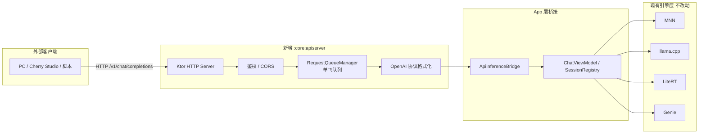

# droid-llm · OpenAI 兼容 API 服务器方案

> 状态：**方案已定，未实施**（P7 候选）。来源参考：MnnLlmChat 本地 API（Ktor）。
> 设计前提见 `DESIGN.md` §10.7：「对外暴露推理服务 API（OpenAI 兼容）作为 P5+ 可选增强：
> 架构上只需在 `LlmEngine` 之上包一层本地 HTTP server，不影响现有接口设计。」
> 本文是该条的落地方案；与 `DESIGN.md` 冲突时以 `DESIGN.md` 为准。

## 1. 目标

在手机内嵌 HTTP Server，对外暴露 **OpenAI 兼容接口**，使 PC / Cherry Studio / 脚本可直接调用
droid-llm 已配置的本地模型。不改 `LlmEngine` 契约，不动各引擎适配器。

## 2. 源能力盘点（MnnLlmChat）

| 层 | 能力 | 关键实现 |
|----|------|----------|
| 传输 | Ktor 3.1.3 + Netty 内嵌服务器 | `OpenAIApplication.kt` |
| 端点 | `POST /v1/chat/completions`（stream / 非 stream）、`GET /v1/models`、`POST /v1/messages`（Anthropic）、队列状态/清空、测试页 | `network/routes/` |
| 协议 | OpenAI `chat.completion` / `chat.completion.chunk`（SSE）；Anthropic 适配器 | `ChatResponseFormatter` / `AnthropicAdapter` |
| 安全 | Bearer + `x-api-key`（默认开）、CORS 可配、随机 16 位 API Key | `HTTP.kt` / `ApiAuthUtils` / `ApiServerConfig` |
| 调度 | 单飞请求队列，同一时刻只跑一个生成任务 | `RequestQueueManager` |
| 运行时 | 前台 Service + WakeLock + 通知栏控制 | `OpenAIService` |
| 桥接 | `ChatSessionProvider` 解耦 chat 模块 | `interfaces/ChatSessionProvider.kt` |
| 配置 | 端口 8080、绑定 IP、CORS、鉴权、API Key | `ApiServerConfig`（SharedPreferences） |
| UI | API 设置面板、API 控制台（在线试调） | `ApiSettingsBottomSheetFragment` 等 |

## 3. 与 droid-llm 的映射



| 维度 | MnnLlmChat | droid-llm |
|------|-----------|-----------|
| 推理入口 | `LlmSession.submitFullHistory` | `LlmEngine.generate(handle, GenerateRequest, onEvent)` |
| 事件模型 | `GenerateProgressListener` 回调 | `EngineEvent.Token/Done/Error`（已够用） |
| 会话获取 | 紧耦合 ChatActivity | 新增 `ApiInferenceBridge`，app 层提供会话 |
| 消息格式 | 多模态 `OpenAIGenericMessage` | `ChatMessage(role, content: String)` 纯文本，首期拒 image |
| 模型标识 | 单模型 `CurrentModelManager` | `/v1/models` 列 `LocalModel`，请求 `model` 字段路由 |
| 配置存储 | SharedPreferences | 并入 `AppSettingsStore`（DataStore） |
| 引擎范围 | 仅 MNN | 四引擎统一走 `LlmEngine` |

**不破坏的契约**（AGENTS.md「关键契约」）：`LlmEngine` 接口、TTFT 口径、单会话 generate 互斥、
显式拒绝不支持 Backend。排队在 HTTP 侧做，不在引擎侧绕。

## 4. 技术选型

| 选项 | 包体 / 内存 | SSE / 取消 | 协程 | 结论 |
|------|------------|-----------|------|------|
| **Ktor 3.x + CIO** | 中（约 +2MB） | 完整插件 | 原生 | **推荐** |
| Ktor + Netty | 大（约 +3–4MB，Netty 偏重） | 同上 | 原生 | 服务端 JVM 更合适，Android 偏重 |
| NanoHTTPD | 最小 | 需手写，取消链路弱 | 需适配 | 仅适合极简非流式 |
| llama.cpp `llama-server` | C++ 极快 | 完整 | — | 绑死单引擎，不满足四引擎统一 API |

**为什么不是「性能最好」而是「最合适」**：本地 API 的瓶颈是 **LLM 推理**（秒～分钟级），
不是 HTTP 层（微秒级）。单飞队列下 QPS=1，HTTP 框架的吞吐差异可忽略。
真正起作用的指标是：**包体、内存、SSE/取消正确性、与 Kotlin 协程/生命周期的契合**。
故选 Ktor + CIO（相对 Netty 更省，相对 NanoHTTPD 流式更稳），与源实现可对照移植。

若后续实测包体/内存仍敏感，路由层不绑 Ktor 语法，可换 NanoHTTPD 或直接复用
llama.cpp 引擎自带 server（仅该引擎），架构接口（`ApiInferenceBridge`）保持不变。

## 5. 模块与目录

```
:core:apiserver                    # 纯 Kotlin + Ktor，不依赖 :app
├─ ApiServerConfig                 # 端口/IP/CORS/鉴权/Key（读 DataStore 接口）
├─ ApiServer                       # embeddedServer 启停
├─ routes/    ModelsRoutes, ChatRoutes
├─ protocol/  OpenAiDtos, ChatResponseFormatter
├─ queue/     RequestQueueManager  # 单飞队列（参考 MnnLlmChat 移植）
├─ auth/      ApiAuthUtils
└─ bridge/
   ├─ ApiInferenceBridge           # 接口：listModels / ensureSession / generate
   └─ （实现放 :app，接 ChatViewModel / SessionRegistry）
```

app 侧：

```
:app/.../service/ApiForegroundService   # 前台服务 + WakeLock + 通知
:app/.../ui/settings/ApiServerSection   # Settings 内「API 服务器」分区
```

## 6. API 面（首期）

| 方法 | 路径 | 说明 |
|------|------|------|
| `GET` | `/v1/models` | 列出已配置模型，`id` = `LocalModel.id` |
| `POST` | `/v1/chat/completions` | `stream: true/false`；`model` 选模型；`messages` 纯文本 |
| `GET` | `/` | 极简状态页（可选，连通性验证） |

鉴权：`Authorization: Bearer <key>` 或 `x-api-key`，**默认开启**，Key 首次随机 16 位。

请求映射：

- `temperature / top_p / max_tokens / stop` → `InferenceConfig`（不适用字段由引擎记 warning）
- `messages[]` → `List<ChatMessage>`；system 由 app 层解析进 `InferenceConfig.systemPrompt`
  （契约：适配器不得再前置）
- `stream=true` → SSE `chat.completion.chunk` + 结尾 `data: [DONE]`
- `stream=false` → 一次 `chat.completion`，`usage` 取 `EngineMetrics.promptTokens/generatedTokens`

**首期明确不做**：图片输入、tool/function calling、Anthropic `/v1/messages`、HTTPS、
embeddings、`/v1/queue/*` 管理端点。

## 7. 运行时与会话桥接

1. **单飞队列必须有**：`LlmEngine` 契约是单会话同时只能一个 `generate`。HTTP 侧排队。
2. **会话互斥策略（首期）**：API 服务运行时**独占当前驻留模型会话**，UI 聊天暂停或排队进同一队列；
   Settings 标明「API 运行中与聊天互斥」。避免两路并发打爆单会话。
3. **模型加载**：`ApiInferenceBridge.ensureSession(modelId)` 走 app 层 load 路径；
   **禁止主线程 load**（MnnLlmChat 曾因此 ANR）。
4. **前台 Service**：`FOREGROUND_SERVICE_DATA_SYNC` + `POST_NOTIFICATIONS` + Partial WakeLock；
   通知显示「运行中 · 端口 · 当前模型」，可停止。
5. **取消**：客户端断开 SSE → `GenerateJob.cancel()`，队列继续下一任务。
6. **生命周期**：停服务释放 wake lock；会话是否 unload 与 UI 共用策略一致（首期独占则 unload）。

## 8. UI（Settings 一节）

- 开关「启用 API 服务器」
- 端口（默认 8080）、绑定 IP（默认 `127.0.0.1`；LAN 访问改 `0.0.0.0`）
- API Key 显示 / 复制 / 重新生成
- 鉴权开关、CORS 开关（默认关）
- 运行状态（运行中 · 端口 · 当前模型）

不做 MnnLlmChat 式 BottomSheet 控制台；试调用用 PC `curl` / OpenAI SDK。

## 9. 实施阶段（P7 候选拆解）

| 阶段 | 内容 | DoD |
|------|------|-----|
| **A1** | `:core:apiserver` 骨架 + Config + Auth + `/v1/models` | 单测过；模拟器 curl 见模型列表 |
| **A2** | `/v1/chat/completions` 非流式 + 队列 + Bridge | FakeEngine 单测；真机 curl 非流式返回 |
| **A3** | SSE 流式 + 断开取消 | token 正常、断开不卡队列 |
| **A4** | 前台 Service + 通知 + Settings UI | 开关全链路；PC OpenAI SDK 调通 |
| **A5**（可选） | Anthropic `/v1/messages`、状态页 | Claude 客户端可连 |

粗估：A1–A2 约 2–3 天，A3–A4 约 2 天，A5 另计。

## 10. 风险与边界

| 风险 | 对策 |
|------|------|
| 与 UI 抢会话 | 首期 API 独占会话；后续再评估共存 |
| 主线程 load 导致 ANR | `ensureSession` 一律 IO 调度 |
| 包体/内存 | 选 CIO 而非 Netty；实测超预算再换 NanoHTTPD |
| 多模态请求 | 含 image 的 message 回 `400` |
| 破坏引擎契约 | API 层只调 `LlmEngine` 公开接口；不加静默回退 |

## 11. 验收清单

1. Settings 打开 API 后，PC `curl http://<phone>:8080/v1/models` 返回模型列表（带 Key）
2. 非流式 `/v1/chat/completions` 返回合法 `chat.completion` JSON
3. 流式请求 token 逐条到达，结束有 `data: [DONE]`
4. 错误 Key → `401`；含 image → `400`；无会话/模型未配置 → 明确错误体
5. 客户端中断流式后，可继续下一次请求（队列不卡死）
6. `:core:engine-api:testDebugUnitTest` 等既有测试全绿；引擎契约测试无回归
